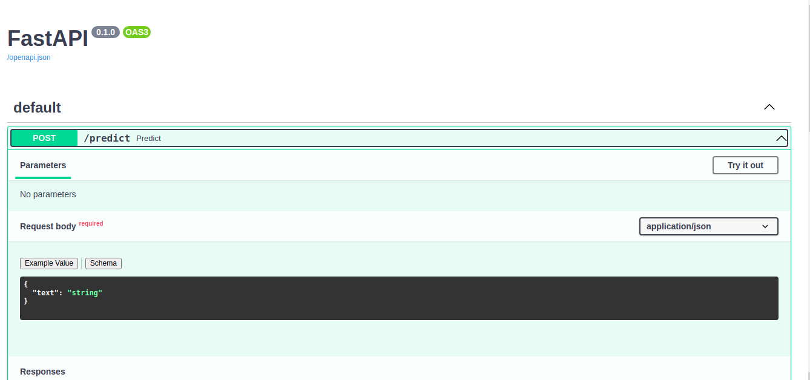

# GenderBasedViolence API



## Project setup
1. donwload the model from Google Drive.
```
python download_model.py
```

2. Launch the service with the following command:
```
cd api

uvicorn api.main:app
```

## Posting requests locally
When the service is running, try
```
127.0.0.1:8000/docs#
```
or 
```
curl
```

## Deployment with Docker
1. Build the Docker image
```
docker build --file Dockerfile --tag gbv-api .
```

2. Running the Docker image
```
docker run -p 8000:8000 gbv-api
```

